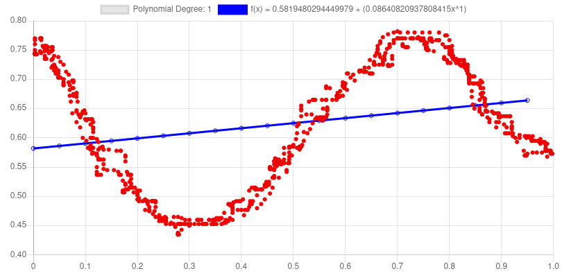

# Polynomial Regression Visualization
A polynomial regression interface to experiment with. Made with react JS, Chart.js and Mathjs. 

<div align="center" width="100%">
  
</div>

### Dependecies
This project also needs the listed dependencies below to work properly, that can easily be installed running the described command. 

* chart.js@^2.9.4
* mathjs@^8.0.1

```sh
npm install
```

## Usage
```sh
npm start
```

## License
Distributed under the MIT License. See [LICENSE](https://github.com/MenesesGHZ/polynomial-regression-js/blob/master/LICENSE) for more information.
